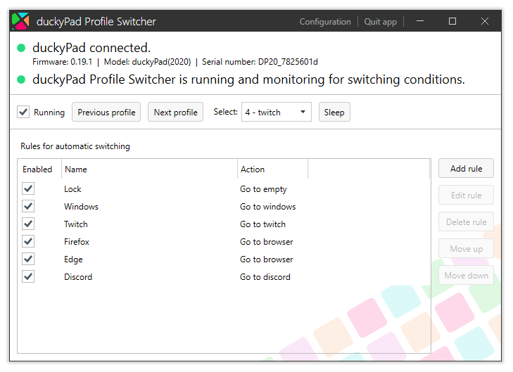
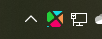
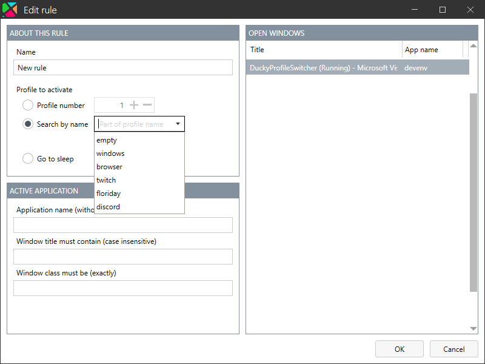

# DuckyProfileSwitcher

DuckyProfileSwitcher switches the profile on your [duckyPad](https://github.com/dekuNukem/duckyPad) when the active window changes. Currently only available for Windows. Very much inspired by the [official application](https://github.com/dekuNukem/duckyPad-profile-autoswitcher).

## Usage

When running, the application should automatically detect your duckyPad and display some information about it. It does not automatically monitor which program is active. This can be enabled by ticking the _Running_ checkbox, enabling it in the configuration, or by passing the flag `run` as a command line parameter. The main window can be hidden on launch by passing the flag `hidden` as a command line parameter.

The application minimizes to the system tray when the window is closed. The tray icon can also be hidden in the configuration. If you've closed the window, and the tray icon is invisible, simply run the program again. It will signal the existing process to show its window again. You can also close it via Task Manager.

Rules can be added, edited, deleted, and moved. Actions and conditions can be defined in the rule editor. You can select the number of a profile to go to. Alternatively, you may enter (part of) a profile's name, and the first profile that matches will be selected. There is also an option to send the duckyPad to sleep mode, but this is not currently implemented in firmware.

Window monitoring criteria are set here as well. For an active application to be triggered, the application/process name, window title and window class (for example `Shell_TrayWnd` for the primary taskbar). Double click one of the windows in the list of open windows to fill in the relevant information.

